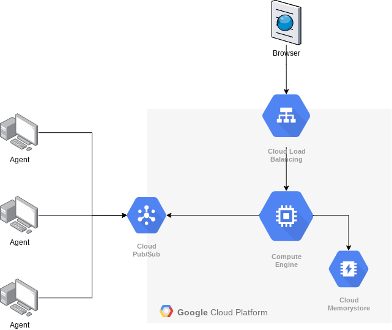

# nodejs-cmdq

Experiment on using pubsub as an RPC command queue for remote agents


# what it do



Use pubsub as an RPC mechanism for remote agents running inside or outside of GCP to receive commands and return results.  

Agents receive a query on a pubsub topic, with a URL to post the results as part of the request.  Agents use the service account key and the Google IAM Credentials API to generate an ID token as part of the response.  This makes sure only the agent that is responsible for executing the request can post the response.

There is also a web app that you can use to launch "commands" to agents.  Agents send heartbeat messages to the server every 15 seconds on a separate topic.  This indicates agent status to the server and connected agents are shown in the dropdown selection box.  


# pre-requisites

1. GCP Project
1. Somewhere to run the server in GKE - Cloud Run, GKE, or a VM
1. Some kind of publically accessible way of contacting the VM - like a Load Balancer, reverse proxy, or just external IP on the VM with a port exposed.  
1. 2 Pubsub topics:
   - one for commands to send to agents (e.g. `cmdq`)
   - one for agents to send heartbeat messages to the server. (e.g. `agent-heartbeat`)
1. N Pubsub Subscriptions:
   - one for server to consume messages on heartbeat topic (e.g. `agent-heartbeat-sub`)
   - one for _each_ agent to consume commands (e.g. `cmdq-agent1`, `cmdq-agent2`, etc)
     - Each subscription should have a filter so agents consuming messages only get messages delivered intended for it.  Set the filter for an agent's subscription to `attributes.agent = <agentid>`.
       - (why not one topic per agent?  this allows the server to publish messages on a single topic instead of multiplexing between multiple topics)
1. Redis (Cloud Memorystore works well) - to store intermediate results and agent heartbeat  statuses.

# permissions

The project requires
- 1 service account for the *server* process
- 1 service account for _each_ *agent* process

If running the agent outside of GCP, you will need to export the service account keys to a json file and set the path in the environment variable `GOOGLE_APPLICATION_CREDENTIALS`.  Please keep the keys safe.  TODO is a way to rotate and deliver encrypted service account keys to agents from the server using pubsub / cloud kms.

The *server* service account needs the following roles:
- Cloud PubSub Publisher access to a command queue *PubSub topic* (e.g. `cmdq`) - to be able to publish command messages
- Cloud PubSub Subscriber access to a *PubSub Subscription* on the agent heartbeat topic (e.g. `agent-heartbeat-sub`) - to be able to consume heartbeat messages

Each *agent* service account needs the following roles:
- Cloud PubSub Publisher access to the agent heartbeat *PubSub topic* (e.g. `agent-heartbeat`) - to be able to publish heartbeat messages
- Cloud PubSub Subscriber access to the agent's *PubSub subscription* on the command queue (e.g. `cmdq-agent1`, etc) - to be able to consume command messages
- Service Account Token Creator access to the agent's own *Service Account* - to be able to generate ID tokens for the agent's identity for posting results.

# configuration

## server

Server needs the following environment variables:

```
PORT=3000                                                  # port for server to listen on
MY_URL=http://localhost:3000                               # URL exposed to agent to post results
PUBSUB_API_ENDPOINT=us-central1-pubsub.googleapis.com:443  # API endpoint for pubsub (messages are stored in region)
PUBSUB_PROJECT_ID=my-project                               # project ID where all pubsub resources are located
PUBSUB_CMD_TOPIC_NAME=cmdq                                 # name of the pubsub topic for commands
PUBSUB_HEARTBEAT_SUB=agent-heartbeat-sub                   # name of the pubsub subscription for heartbeats
REDISHOST=localhost                                        # IP/hostname of redis server
REDISPORT=6379                                             # port of redis server
```

## agent

Agent needs the following environment variables:

```
PUBSUB_API_ENDPOINT=us-central1-pubsub.googleapis.com:443  # API endpoint for pubsub
PROJECT_ID=jkwng-pubsub-cmdq                               # project ID where all pubsub resources are located
PUBSUB_CMD_SUB=cmdq-sub                                    # subscription to consume command messages
PUBSUB_HEARTBEAT_TOPIC=agent-heartbeat                     # topic to publish heartbeat messages
```

## web app

Set the API backend in [the axios config](./vuejs-cmd/src/plugins/axios.js), or set the baseURL environment variable if running locally

```
baseURL=https://cmdq.jkwong.info
```